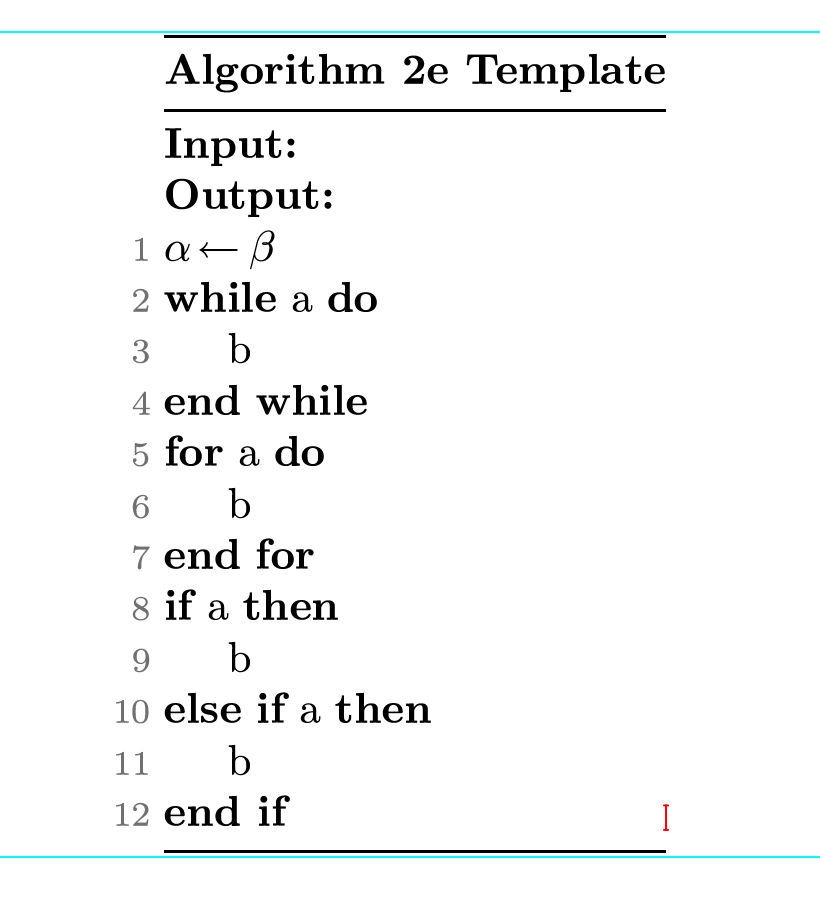

# Algorithm2e-TeXmacs

The original algorithm environment in [TeXmacs](https://www.texmacs.org/tmweb/home/welcome.en.html) and [Mogan](https://mogan.app/) (A distribution of TeXmacs) does not provide a proper numbered line. For example, the lines of conditional commands such as $\texttt{if}$, $\texttt{while}$ are not numbered.

This package provides a simple modification of the TeXmacs/Mogan algorithm environment to achieve proper numbered line.

We provide a template $\texttt{algo2e-template.tm}$, the user can copy and modify the template. 



# Installation

In Unix-Like System, run the following command on Bash/Zsh:

```shell
cd ~/.TeXmacs/packages/ && git clone git@github.com:JackYansongLi/algorithm2e-texmacs.git
```

If you are using Mogan instead of TeXmacs, run the following command instead

```shell
cd ~/.Xmacs/Library/Application Support/XmacsLabs/packages/ && git clone git@github.com:JackYansongLi/algorithm2e-texmacs.git
```

In Windows, drag the .ts file to the $\texttt{package}$ subfolder where the TeXmacs/Mogan is installed.

# Usage

To activate this package, select the following command in taskbar: $\texttt{Document} \rightarrow \texttt{Style}\rightarrow \texttt{Add Package}\rightarrow \texttt{Algorithm-2e}\rightarrow \texttt{{algorithm-2e}}$.

Once the package is activated, The following macros are provided:

* $\texttt{algo2e-input}$
* $\texttt{algo2e-output}$

The above two macros can be put anywhere inside the $\texttt{Algorithm}$ environment. The following command must be put inside the $\texttt{numbered}$ sub-environment inside the $\texttt{Algorithm}$ environment. To activate the $\texttt{numbered}$ sub-environment, simply type $\texttt{\numbered}$ inside the Algorithm environment and hit $\texttt{Enter}$

* $\texttt{algo2e-while}$
* $\texttt{algo2e-for}$
* $\texttt{algo2e-if}$
* $\texttt{algo2e-else}$
* $\texttt{algo2e-else-if}$
* $\texttt{algo2e-end-if}$

To use the macro, simply type \ followed by the name of the macro and hit $\texttt{Enter}$. Once the $\texttt{Enter}$ is hit, you will see something like $\texttt{<algo2e-if<|>>}$. Insert anything such as $\texttt{<algo2e-if<a|b>>}$ in the template and hit $\texttt{Enter}$ again, you will see the rendered text. When you see the rendered text, hit $\texttt{Enter}$ again to properly render the line number. The line number will not be properly rendered if you do not type this extra $\texttt{Enter}$.

If the above procedure confuses you, simply copy and paste the part you needed in $\texttt{algo2e-template.tm}$ to your own project. This is what **WYSIWYG** supposed to provide!
